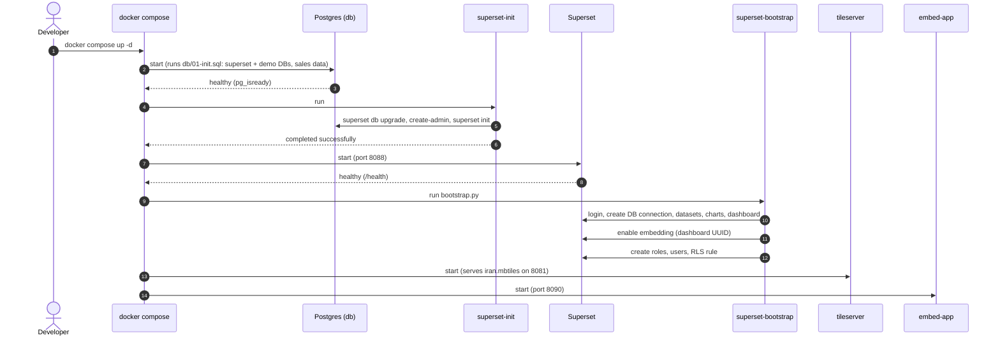
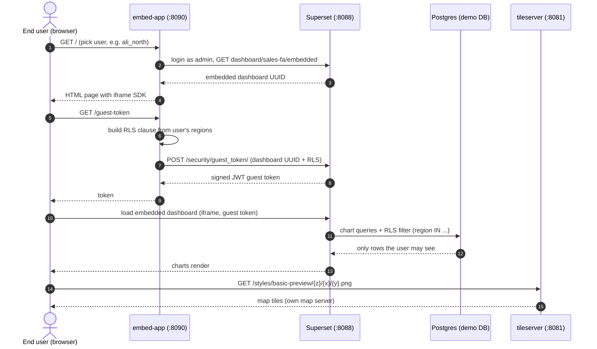

# Superset Demo: Persian Sales Dashboard with Embedding, RLS and a Self-Hosted Map

A fully containerised demo of **Apache Superset 6.1** that shows:

- 🇮🇷 **Persian (fa) localisation** and **Jalali (Shamsi) calendar** aggregation
- 🗺️ **Self-hosted map server** (vector tiles built from OpenStreetMap Iran via Planetiler, served by TileServer GL) used as the deck.gl base map, with no Mapbox key
- 🔐 **Row-level security (RLS)** driven by the logged-in user (`{{ current_username() }}`)
- 🧩 **Embedding** a dashboard in a host app through an iframe with **guest tokens** and per-user dynamic RLS
- 🤖 A **bootstrap script** that creates the DB connection, datasets, charts, dashboard, roles, users and embedding automatically

## Architecture

| Service | Image | Port | Purpose |
|---|---|---|---|
| `db` | `postgres:16` | 5440 | Superset metadata DB (`superset`) and mock business DB (`demo`) |
| `redis` | `redis:7-alpine` | n/a | Cache |
| `superset-init` | `superset-demo:6.1.0-pg` | n/a | One-shot: `db upgrade`, create admin, `superset init` |
| `superset` | `superset-demo:6.1.0-pg` | 8088 | Superset web app |
| `superset-bootstrap` | `superset-demo:6.1.0-pg` | n/a | One-shot: provisions charts, dashboard, roles, users, RLS, embedding |
| `tileserver` | `maptiler/tileserver-gl:v5.3.1` | 8081 | Serves `tiles/iran.mbtiles` as raster/vector tiles |
| `embed-app` | `superset-demo:6.1.0-pg` | 8090 | Flask host app that embeds the dashboard via guest tokens |

## Sequence Diagram

### 1. Startup



### 2. Embedded dashboard with guest token and RLS



## Prerequisites

- Docker and Docker Compose v2
- ~2 GB free disk (plus the map tiles, see below)
- Free ports: `5440`, `8081`, `8088`, `8090`

## How to Bring It Up

### 1. Clone

```bash
git clone https://github.com/alip990/superset-demo.git
cd superset-demo
```

### 2. Build the Superset image

The stock image lacks the Postgres driver, so build the small custom image referenced by `docker-compose.yml`:

```bash
docker build -t superset-demo:6.1.0-pg ./superset
```

### 3. Provide the map tiles

`tiles/iran.mbtiles` (~580 MB) is **not** stored in git. Generate it once with Planetiler from an OSM extract:

```bash
mkdir -p tiles
curl -L -o tiles/iran-latest.osm.pbf https://download.geofabrik.de/asia/iran-latest.osm.pbf
docker run --rm -v "$(pwd)/tiles:/data" onthegomap/planetiler:latest \
  --osm-path=/data/iran-latest.osm.pbf --output=/data/iran.mbtiles
```

> The tileserver serves the `basic-preview` style. If your tileserver has no `styles/` config for it, adjust the tile URL in `superset/superset_config.py` and `superset/bootstrap.py`.

### 4. Start everything

```bash
docker compose up -d
docker compose logs -f superset-bootstrap   # wait for BOOTSTRAP_DONE
```

The first start takes a few minutes (DB migrations plus bootstrap).

### 5. Open the apps

| App | URL | Login |
|---|---|---|
| Superset | http://localhost:8088 | `admin` / `admin` |
| Embedded host app | http://localhost:8090 | pick a demo user in the page |
| Tile server | http://localhost:8081 | n/a |
| Postgres | `localhost:5440` | `postgres` / `postgres` |

The dashboard slug is `sales-fa` (`http://localhost:8088/superset/dashboard/sales-fa/`).

### Demo users (Superset, password = username)

| User | Regions (RLS via `user_access` table) |
|---|---|
| `ali_north` | north |
| `sara_south` | south, center |
| `manager` | north, south, center, east, west |

In the embedded app the same users' regions are turned into a dynamic guest-token RLS clause instead.

### Stop and reset

```bash
docker compose down        # stop, keep data
docker compose down -v     # stop and wipe the Postgres volume
```

## Onboarding

New to the project? Read **[docs/ONBOARDING.md](docs/ONBOARDING.md)**: how each piece is implemented, the plugin guide, common tasks, troubleshooting and known limitations.

## Project Layout

```
.
├── docker-compose.yml        # all services
├── db/01-init.sql            # creates DBs, Jalali function, mock sales data, user_access
├── superset/
│   ├── Dockerfile            # Superset 6.1.0 + psycopg2
│   ├── superset_config.py    # fa locale, feature flags, embedding, base map
│   └── bootstrap.py          # provisions charts, dashboard, roles, users, RLS
├── docs/ONBOARDING.md        # implementation guide for new teammates
├── embed-app/                # Flask host app (guest tokens + iframe)
├── tiles/                    # iran.mbtiles goes here (git-ignored)
└── plugins/                  # reserved for custom viz plugins (empty today)
```

## Security Note

This is a **demo**. It uses default credentials, a static JWT secret, CORS/iframe restrictions relaxed and Talisman disabled. Change `SUPERSET_SECRET_KEY`, `GUEST_TOKEN_JWT_SECRET`, all passwords, and set a real CSP before any real deployment.
