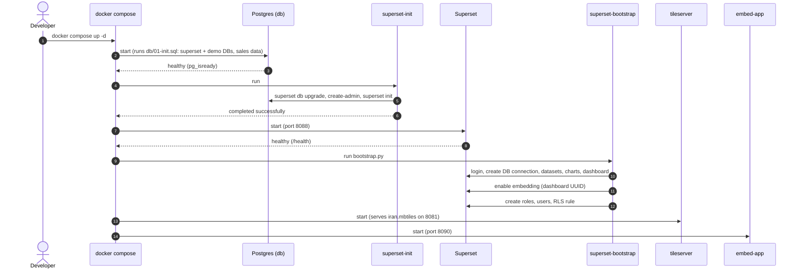
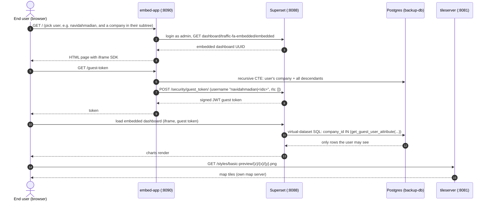

# Superset Demo: Persian Sales Dashboard with Embedding, RLS and a Self-Hosted Map

A fully containerised demo of **Apache Superset 6.1** that shows:

- 🇮🇷 **Persian (fa) localisation** and **Jalali (Shamsi) calendar** aggregation
- 🗺️ **Self-hosted map server** (vector tiles built from OpenStreetMap Iran via Planetiler, served by TileServer GL) used as the deck.gl base map, with no Mapbox key
- 🔐 **Row-level security (RLS)** driven by the logged-in user (`{{ current_username() }}`)
- 🧩 **Embedding** a dashboard in a host app through an iframe with **guest tokens** and per-user dynamic RLS
- 🤖 A **bootstrap script** that creates the DB connection, datasets, charts, dashboard, roles, users and embedding automatically

## Architecture

| Service | Image | Port | Purpose |
|---|---|---|---|
| `db` | `postgres:16` | 5440 | Superset metadata DB (`superset`) and mock business DB (`demo`) |
| `redis` | `redis:7-alpine` | n/a | Cache |
| `superset-init` | `superset-demo:6.1.0-pg` | n/a | One-shot: `db upgrade`, create admin, `superset init` |
| `superset` | `superset-demo:6.1.0-pg` | 8088 | Superset web app |
| `superset-bootstrap` | `superset-demo:6.1.0-pg` | n/a | One-shot: provisions charts, dashboard, roles, users, RLS, embedding |
| `tileserver` | `maptiler/tileserver-gl:v5.3.1` | 8081 | Serves `tiles/iran.mbtiles` as raster/vector tiles |
| `embed-app` | `superset-demo:6.1.0-pg` | 8090 | Flask host app that embeds the dashboard via guest tokens |

## Sequence Diagram

### 1. Startup



### 2. Embedded dashboard with guest token and RLS



## Prerequisites

- Docker and Docker Compose v2
- ~2 GB free disk (plus the map tiles, see below)
- Free ports: `5440`, `8081`, `8088`, `8090`

## How to Bring It Up

### 1. Clone

```bash
git clone https://github.com/alip990/superset-demo.git
cd superset-demo
```

### 2. Build the Superset image

The stock image lacks the Postgres driver, so build the small custom image referenced by `docker-compose.yml`:

```bash
docker build -t superset-demo:6.1.0-pg ./superset
```

### 3. Provide the map tiles

`tiles/iran.mbtiles` (~580 MB) is **not** stored in git. Generate it once with Planetiler from an OSM extract:

```bash
mkdir -p tiles
curl -L -o tiles/iran-latest.osm.pbf https://download.geofabrik.de/asia/iran-latest.osm.pbf
docker run --rm -v "$(pwd)/tiles:/data" onthegomap/planetiler:latest \
  --osm-path=/data/iran-latest.osm.pbf --output=/data/iran.mbtiles
```

> The tileserver serves the `basic-preview` style. If your tileserver has no `styles/` config for it, adjust the tile URL in `superset/superset_config.py` and `superset/bootstrap.py`.

### 4. Start everything

```bash
docker compose up -d
docker compose logs -f superset-bootstrap   # wait for BOOTSTRAP_DONE
```

The first start takes a few minutes (DB migrations plus bootstrap).

### 5. Open the apps

| App | URL | Login |
|---|---|---|
| Superset | http://localhost:8088 | `admin` / `admin` |
| Embedded host app | http://localhost:8090 | pick a demo user in the page |
| Tile server | http://localhost:8081 | n/a |
| Postgres | `localhost:5440` | `postgres` / `postgres` |

The dashboard slug is `sales-fa` (`http://localhost:8088/superset/dashboard/sales-fa/`).

### Demo users (Superset, password = username)

| User | Regions (RLS via `user_access` table) |
|---|---|
| `ali_north` | north |
| `sara_south` | south, center |
| `manager` | north, south, center, east, west |

The embedded app (http://localhost:8090) shows the traffic dashboard `traffic-fa-embedded` on the restored
backup data, scoped by the **company tree**. Pick one of the backup's real users (e.g. `fkreza` = national,
`navidahmadian` = Qom, `rezailka` = Tehran), then optionally a company inside that user's subtree. See [SUPERSET_RLS_GUIDE.md](SUPERSET_RLS_GUIDE.md).

Direct logins `traffic_national`, `traffic_qom` and `traffic_tehran` see the same split on the
`traffic-fa` dashboard through a regular RLS rule.

### Stop and reset

```bash
docker compose down        # stop, keep data
docker compose down -v     # stop and wipe the Postgres volume
```

## Developer Guide (Onboarding)

Read this after the stack is running. It explains how the demo is built, where to change things, and how to extend it.

### Mental model (5 minutes)

```
 Browser ──► embed-app (Flask, :8090) ──guest token──► Superset (:8088) ──SQL──► Postgres "demo"
                                                          │  └─ metadata ───► Postgres "superset"
                                                          └─ map tiles ◄──── tileserver (:8081) ◄── tiles/iran.mbtiles
```

Three ideas to hold on to:

1. **Everything is configuration-as-code.** No manual clicking in Superset. `superset/bootstrap.py` calls Superset's REST API to create the connection, datasets, charts, dashboard, roles, users and RLS rule. Re-running it is safe (it looks things up first and updates).
2. **Two kinds of row-level security**, one per access path:
   - *Direct Superset login* → an RLS rule with Jinja: `region IN (SELECT region FROM user_access WHERE username = '{{ current_username() }}')`.
   - *Embedded (guest token)* → the host app packs the user's allowed company ids (their company and all
     companies below it) into the token's username; virtual datasets filter on
     `get_guest_user_attribute('allowed_companies')`. The token's `rls` is empty. See
     [SUPERSET_RLS_GUIDE.md](SUPERSET_RLS_GUIDE.md).
3. **The map is self-hosted.** No Mapbox key; base tiles come from our own tileserver.

### Where each thing is implemented

| Concern | File | What to look at |
|---|---|---|
| Postgres DBs, sample data | `db/01-init.sql` | Creates `superset` (metadata) and `demo` (business) DBs; `provinces` → `branches` → `sales` (random data, ~540 days) and `user_access` |
| Jalali calendar | `db/01-init.sql` | `to_jalali(date)` SQL function fills `jalali_date/month/year` columns; charts group on `jalali_month` |
| Superset image | `superset/Dockerfile` | Stock `apache/superset:6.1.0` + `psycopg2-binary` |
| Superset settings | `superset/superset_config.py` | Persian locale, feature flags, embedding/CORS, guest-token settings, deck.gl base map |
| Provisioning | `superset/bootstrap.py` | REST API calls (connection, datasets, charts, dashboard layout, embedding) then ORM code for roles/users/RLS |
| Host app | `embed-app/app.py`, `embed-app/index.html` | Fake users, company-tree CTE, guest-token endpoint, iframe via `@superset-ui/embedded-sdk` |
| Backup data + BI layer | `backups/restore.sh`, `backups/02-bi.sql` | Restores the beta backup into `backup-db` (:5441) and builds schema `bi` (company tree, `violation` fact table) |
| Traffic dashboards | `superset/bootstrap_traffic.py` | `traffic-fa` (direct login, RLS) and `traffic-fa-embedded` (scoped virtual datasets) |
| Startup ordering | `docker-compose.yml` | `db` healthy → `superset-init` → `superset` healthy → `superset-bootstrap` |

#### Persian + Jalali

- UI language: `BABEL_DEFAULT_LOCALE = "fa"` (English kept in `LANGUAGES`).
- Superset has no native Jalali axis, so dates are pre-computed in SQL and used as plain text dimensions (`x_axis: "jalali_month"`). Trade-off: sorting works because `YYYY-MM` sorts lexically; there is no real date arithmetic.

#### Bootstrap flow (`superset/bootstrap.py`)

1. Log in as `admin`, fetch CSRF token.
2. Create DB connection `Demo DB (mock)` using the read-only user `demo_reader`.
3. Create datasets: `sales` (physical, with metric `total_amount`) and `sales_by_branch` (virtual, SQL aggregate for the map).
4. Create 5 charts (`deck_scatter` map, big number, ECharts bar, pie, table) via `chart()` helper, which upserts by name.
5. Build `position_json` (grid rows/widths) and create dashboard slug `sales-fa`.
6. Enable embedding → prints `EMBEDDED_DASHBOARD_UUID`.
7. Use the Flask app context + ORM to create roles `DemoViewer`, `EmbedGuest`, `RegionalUser`, users, and the RLS filter.

Idempotency: helper `find(resource, col, value)` looks up by name/slug. Renaming a chart in the script therefore creates a *new* one.

#### Embedding and guest tokens (`embed-app/app.py`)

1. Page load: app logs in to Superset as admin and reads the dashboard's embedded UUID.
2. The SDK calls `fetchGuestToken()` → `GET /guest-token`.
3. The app looks up the user's company, flattens the company tree below it with a recursive CTE
   (`bi.company` in `backup-db`), and posts to `/api/v1/security/guest_token/` with username
   `"<user>|<id>, <id>, ..."`, `resources` (the dashboard) and `"rls": []`.
4. Superset returns a signed JWT (`GUEST_TOKEN_JWT_SECRET`, 10 min expiry, role `EmbedGuest`); the iframe uses it.
5. Switching the user in the dropdown re-mounts the iframe with a new token.

Important: the RLS clause is applied to **every dataset** in the dashboard, so all datasets need a `region` column.

#### Map server (no plugin needed)

The map is **not** a custom plugin. It is Superset's built-in deck.gl *Scatterplot* chart (`deck_scatter`) plus a **self-hosted base map**. Superset only needs a tile URL, so the whole integration is a config value, one chart parameter and one extra container.

**Pipeline**

```
OSM Iran extract (.osm.pbf, Geofabrik)
        │  Planetiler (one-off, offline)
        ▼
tiles/iran.mbtiles ──mounted──► tileserver-gl (:8081) ──HTTP──► browser ──► Superset deck.gl map
                                   serves /styles/basic-preview/{z}/{x}/{y}.png
```

1. **Build the tiles (offline, once).** Planetiler turns the OSM extract into an MBTiles file (`tiles/iran.mbtiles`, ~580 MB). It is git-ignored; see the README for the command. Rebuild only if you want fresher OSM data.
2. **Serve them.** `docker-compose.yml` runs `maptiler/tileserver-gl` with `--file /data/iran.mbtiles -p 8080 -u http://localhost:8081`. `-u` is the *public* URL the server embeds in its responses, so it must be what the browser can reach (host port 8081), not the Docker-internal name. The server renders the vector tiles into raster PNGs through its built-in `basic-preview` style.
3. **Point Superset at it.** In `superset/superset_config.py`:
   ```python
   TILE_SERVER = os.environ.get("TILE_SERVER_PUBLIC_URL", "http://localhost:8081")
   DECKGL_BASE_MAP = [[f"tile://{TILE_SERVER}/styles/basic-preview/{{z}}/{{x}}/{{y}}.png", "Own map server (Iran, basic)"]]
   MAPBOX_API_KEY = ""
   ```
   `DECKGL_BASE_MAP` adds our server to the base-map dropdown in deck.gl charts. Emptying `MAPBOX_API_KEY` means no request ever goes to Mapbox.
4. **Use it in the chart.** `superset/bootstrap.py` sets `mapbox_style` on the `deck_scatter` chart to the same `tile://...` URL, with the viewport centred on Iran (lon 53.7, lat 32.4, zoom 4.4). Points come from the `sales_by_branch` dataset (`lat`, `lon`, `SUM(amount)`).
5. **Browser fetches tiles directly.** Tile requests go from the user's browser to `localhost:8081`, not through Superset. That is why the tileserver publishes a port and why it also works inside the embedded iframe.

**Why raster `tile://` and not a MapLibre style.json?** Superset's `mapbox_style` field validates its input and only accepts `mapbox://styles/...` or `tile://http(s)://...` (raster XYZ). A bare `style.json` URL is silently rejected and no base map is drawn. So we let tileserver-gl do the vector-to-raster rendering and give Superset plain XYZ PNG tiles.

**Trade-offs of this approach**
- Raster tiles: no client-side restyling, no rotating/pitching a crisp vector map, and less sharp on high-DPI screens.
- Only Iran is covered; outside the extract the map is blank.
- Styling is limited to what tileserver-gl's styles offer. A different look means supplying your own style (mount it into the tileserver and change the `/styles/<name>/` part of the URL in **both** `superset_config.py` and `bootstrap.py`).
- The map data must stay in sync between those two files, since the chart stores its own copy of the URL.

**When would a plugin be needed?** Only if you want true vector rendering (MapLibre GL), custom layers or interactions the built-in deck.gl charts do not offer. See *Plugins* below. For this demo the built-in chart plus config was enough, and it avoids building Superset's frontend from source.

**Checking it works**
- `http://localhost:8081` lists the available styles/data.
- `http://localhost:8081/styles/basic-preview/5/20/12.png` should return a PNG tile.
- If points appear on a blank/grey background, the chart works but the tile URL is unreachable or the style name is wrong.

### Plugins

**Current status: no custom plugin is implemented.** `plugins/` is an empty placeholder. All charts, including the map, are built-in Superset viz types (the map is `deck_scatter`). Anything below is a guide for adding one, not a description of existing code.

There are two things people call "plugin" here; pick the right one:

| You want | Approach |
|---|---|
| A new chart type (custom visualization) | Superset **viz plugin** (React/TypeScript), below |
| Different base map / styling | No plugin: edit `DECKGL_BASE_MAP` in `superset_config.py` (see *Map server* above) |
| Custom auth, security rules, Jinja macros | Python config hooks in `superset_config.py` (`CUSTOM_SECURITY_MANAGER`, `JINJA_CONTEXT_ADDONS`), no frontend build |

#### Building a custom viz plugin

Prerequisites: Node.js (match the version in the Superset repo's `superset-frontend/.nvmrc`), npm, and a checkout of the Superset repo at the tag matching our version (`6.1.0`).

1. **Scaffold** inside `plugins/`:
   ```bash
   npm install -g yo @superset-ui/generator-superset
   cd plugins && yo @superset-ui/superset
   ```
   This creates `plugins/plugin-chart-<name>/` with `src/plugin/{index,controlPanel,buildQuery,transformProps}.ts` and `src/<Name>.tsx`.
2. **Understand the four pieces**
   - `controlPanel.ts`: the form the user fills in (metrics, group-by, options).
   - `buildQuery.ts`: turns form data into the query sent to the backend.
   - `transformProps.ts`: converts the query result into props for your component.
   - `<Name>.tsx`: the React component that renders.
3. **Register it in Superset**: in `superset-frontend`, `npm i -S ../path/to/plugins/plugin-chart-<name>`, then add it to `superset-frontend/src/visualizations/presets/MainPreset.js`:
   ```js
   import MyChartPlugin from 'plugin-chart-<name>';
   new MyChartPlugin().configure({ key: 'my_chart' }),
   ```
4. **Build the image.** The stock image ships a pre-built frontend, so a plugin means building the frontend from source. Typical approach: a multi-stage Dockerfile in `superset/` that clones Superset 6.1.0, copies `plugins/`, applies steps 3, runs `npm ci && npm run build`, then packages it. Point `image:` in `docker-compose.yml` at the result (or add a `build:` block).
5. **Use it in bootstrap**: add a `chart("...", "my_chart", ds, {...})` entry in `superset/bootstrap.py`.

Notes:
- Superset also has an experimental `DYNAMIC_PLUGINS` feature flag that loads plugin bundles at runtime without a rebuild; it is not enabled here and not tested for this stack.
- Verify all of the above against the Superset 6.1 docs ("Creating Visualization Plugins") before committing to it. These steps were written from general knowledge of the plugin system and were **not executed in this repo**.

### Common tasks

| Task | How |
|---|---|
| Add a chart | New `chart(...)` call in `bootstrap.py`, add its key to `charts`, `rows`, `widths`, `heights`; re-run bootstrap |
| Re-run bootstrap | `docker compose run --rm superset-bootstrap` |
| Add an app user (embedded) | Add to `APP_USERS` in `embed-app/app.py` (regions list, `None` = unrestricted) |
| Add a Superset user | Add to the user list in `bootstrap.py`, plus rows in `user_access` in `db/01-init.sql` |
| Change sample data | Edit `db/01-init.sql`, then `docker compose down -v && docker compose up -d` (init scripts run only on an empty volume) |
| Change config | Edit `superset/superset_config.py`, then `docker compose restart superset` |
| Open a SQL shell | `docker compose exec db psql -U postgres -d demo` |
| Tail logs | `docker compose logs -f superset` |
| Get dashboard UUID | `docker compose logs superset-bootstrap \| grep EMBEDDED` |

### Troubleshooting

| Symptom | Likely cause / fix |
|---|---|
| `pull access denied for superset-demo` | Custom image not built: `docker build -t superset-demo:6.1.0-pg ./superset` |
| Map shows points but no base map | Tiles missing (`tiles/iran.mbtiles`), tileserver style name differs, or `localhost:8081` unreachable from the browser. Test `http://localhost:8081` |
| Tileserver exits immediately | `iran.mbtiles` not found in `./tiles` |
| Embedded dashboard blank / refused | CORS origin or iframe headers; check `CORS_OPTIONS` and the `embed-app` URL is exactly `http://localhost:8090` |
| Guest token 401/403 | `GUEST_ROLE_NAME` role missing (bootstrap didn't finish) or JWT secret mismatch |
| Bootstrap `-> 4xx` error | The error prints method, path and body; usually a stale/renamed object. Try a clean reset with `down -v` |
| Users see no data | Missing rows in `user_access` (direct login) or empty `regions` (embed) |
| Postgres changes ignored | `01-init.sql` only runs on first init; wipe volume with `down -v` |

### Known limitations (be upfront with reviewers)

- Demo credentials and static secrets everywhere; Talisman/CSP disabled; `X-Frame-Options: ALLOWALL`.
- `embed-app` logs in as `admin` to mint guest tokens. Production should use a dedicated service account with only guest-token permission.
- Sample data is random; regenerated only on a fresh DB volume.
- Jalali support is a SQL workaround, not native.
- No automated tests and no CI.
- No custom plugin exists yet (see *Plugins* above).

### Suggested first-day path

1. Bring the stack up (README) and open Superset as `admin`, look at the `sales-fa` dashboard.
2. Open http://localhost:8090 and switch between the three users; watch the RLS clause change in the header and the numbers change.
3. Log in to Superset directly as `ali_north` / `ali_north` and compare (RLS via Jinja).
4. Read `bootstrap.py` top to bottom, then `embed-app/app.py`.
5. Try a task from *Common tasks* (add a chart or a user).

## Project Layout

```
.
├── docker-compose.yml        # all services
├── db/01-init.sql            # creates DBs, Jalali function, mock sales data, user_access
├── superset/
│   ├── Dockerfile            # Superset 6.1.0 + psycopg2
│   ├── superset_config.py    # fa locale, feature flags, embedding, base map
│   └── bootstrap.py          # provisions charts, dashboard, roles, users, RLS
├── embed-app/                # Flask host app (guest tokens + iframe)
├── tiles/                    # iran.mbtiles goes here (git-ignored)
└── plugins/                  # reserved for custom viz plugins (empty today)
```

## Security Note

This is a **demo**. It uses default credentials, a static JWT secret, CORS/iframe restrictions relaxed and Talisman disabled. Change `SUPERSET_SECRET_KEY`, `GUEST_TOKEN_JWT_SECRET`, all passwords, and set a real CSP before any real deployment.
